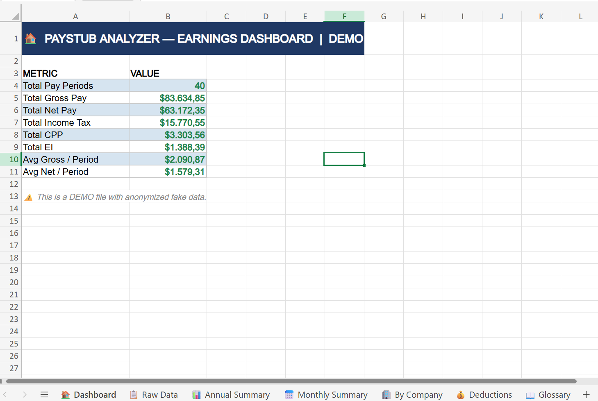
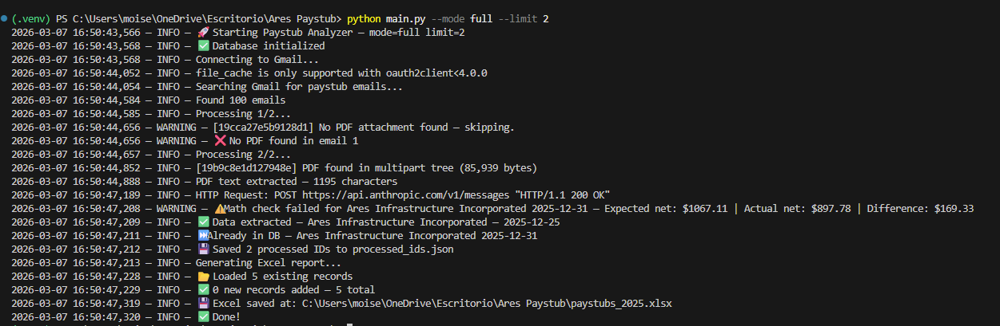
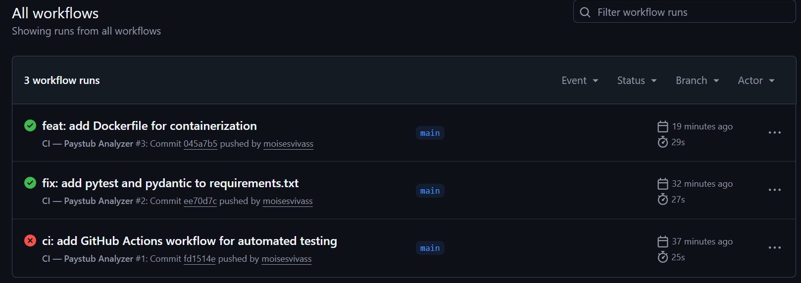

# 📊 Paystub Analyzer — Automated ETL Pipeline


**The problem:** Workers with multiple employers lose track of total earnings, deductions, and tax contributions across pay periods. Manually compiling paystubs into spreadsheets is time-consuming and error-prone.

**What this solves:** An automated pipeline that answers: How much did I earn this year? Are my deductions correct? How do my earnings compare across employers?

Automated ETL pipeline that connects to Gmail, downloads encrypted PDF paystubs, extracts structured payroll data using Claude AI, stores it in a SQLite database, and generates a professional 7-sheet Excel report.

## 📸 Screenshots

### 🏠 Excel Dashboard


### ⚙️ Terminal Output


### ✅ CI/CD Pipeline


## 🚀 What it does

- Connects to Gmail via Google API and finds paystub emails from any company
- Downloads and decrypts password-protected PDF paystubs
- Uses Claude AI (Anthropic) to extract structured payroll data
- Validates extracted data with Pydantic schema enforcement
- Performs math validation (Gross Pay − Deductions = Net Pay)
- Tracks processed emails to avoid duplicate processing
- Stores all data in a SQLite database for SQL querying
- Generates a professional Excel report with 7 sheets

## 📊 Excel Report (7 Sheets)

| Sheet | Description |
|-------|-------------|
| 🏠 Dashboard | Key metrics and totals at a glance |
| 📋 Raw Data | Full earnings history, one row per pay period |
| 📊 Annual Summary | Totals by year |
| 📅 Monthly Summary | Earnings over time |
| 🏢 By Company | Comparison across employers |
| 💰 Deductions | Tax, CPP, EI breakdown |
| 📖 Glossary | Canadian paystub terms explained |

> 📥 Download a sample report with anonymized data: [demo/paystubs_DEMO.xlsx](demo/paystubs_DEMO.xlsx)

## 🛠️ Tech Stack

- **Python 3** — core language
- **Gmail API** — email and PDF retrieval
- **Claude AI (Anthropic)** — intelligent data extraction
- **Pydantic** — data validation and schema enforcement
- **PyPDF2** — PDF decryption and text extraction
- **SQLite** — local database storage
- **OpenPyXL** — Excel report generation
- **pytest** — automated testing with mocks
- **Docker** — containerization
- **GitHub Actions** — CI/CD pipeline
- **python-dotenv** — environment variable management

## ⚙️ Setup Instructions

### 1. Clone the repository
```bash
git clone https://github.com/moisesvivass/paystub-analyzer.git
cd paystub-analyzer
```

### 2. Create and activate virtual environment
```bash
python -m venv .venv
.venv\Scripts\activate        # Windows
source .venv/bin/activate     # Mac/Linux
```

### 3. Install dependencies
```bash
pip install -r requirements.txt
```

### 4. Set up Google Cloud
- Go to [console.cloud.google.com](https://console.cloud.google.com)
- Create a new project
- Enable the Gmail API
- Create OAuth 2.0 credentials (Desktop app)
- Download the credentials JSON file

### 5. Create your `.env` file
```
ANTHROPIC_API_KEY=your_anthropic_api_key
PDF_PASSWORD=your_pdf_password
CREDENTIALS_FILE=path/to/your/client_secret.json
OUTPUT_EXCEL=path/to/output/paystubs.xlsx
EMAIL_QUERY=subject:"Pay Stub" OR subject:"Paystub" OR subject:"payslip"
```

### 6. Run the program
```bash
# Process all emails (recommended limit for testing)
python main.py --mode full --limit 5

# Process all emails — no limit
python main.py --mode full --limit 100

# Only process new emails since last run
python main.py --mode update
```

## 🐳 Run with Docker
```bash
docker build -t paystub-analyzer .
docker run paystub-analyzer
```

## 💻 CLI Reference

| Command | Description |
|---------|-------------|
| `--mode full` | Process all emails |
| `--mode update` | Only new emails since last run |
| `--limit N` | Max number of emails to process |

## 🗄️ Database

All paystubs are stored in a local SQLite database (`paystubs.db`). You can query it directly:

```sql
-- Total earnings by year
SELECT strftime('%Y', pay_period_start) as year,
       SUM(gross_pay) as total_gross,
       SUM(net_pay) as total_net
FROM paystubs
GROUP BY year;

-- Earnings by company
SELECT company, COUNT(*) as periods, SUM(gross_pay) as total
FROM paystubs
GROUP BY company;
```

## 🧪 Running Tests
```bash
pytest tests/ -v
```

Tests use mocks — no real API calls, no cost. ✅

## 📁 Project Structure
```
paystub-analyzer/
├── main.py                        # Entry point + CLI
├── Dockerfile                     # Docker container config
├── requirements.txt               # Dependencies
├── .env                           # Environment variables (never committed)
├── .gitignore                     # Files excluded from GitHub
├── README.md                      # This file
├── demo/
│   └── paystubs_DEMO.xlsx         # Sample report with anonymized data
├── docs/
│   └── images/
│       ├── dashboard.png          # Excel dashboard screenshot
│       ├── terminal.png           # Terminal output screenshot
│       └── ci.png                 # GitHub Actions screenshot
├── .github/
│   └── workflows/
│       └── ci.yml                 # GitHub Actions CI/CD
├── tests/
│   ├── test_claude_extractor.py   # Mocked Claude AI tests
│   ├── test_pdf_processor.py      # PDF processing tests
│   └── test_tracker.py            # Tracker logic tests
└── paystub_analyzer/
    ├── gmail_client.py            # Gmail connection + PDF download
    ├── pdf_processor.py           # PDF decryption + text extraction
    ├── claude_extractor.py        # Claude AI data extraction
    ├── models.py                  # Pydantic data models
    ├── excel_report.py            # Excel report generation
    ├── database.py                # SQLite database layer
    ├── tracker.py                 # Processed email ID tracker
    ├── config.py                  # Loads .env variables
    └── logger.py                  # Logging setup
```

## 🔒 Security

- All credentials stored in `.env` (never committed to GitHub)
- Gmail access is read-only
- No personal data shared externally
- Real Excel files and database excluded from GitHub

## ✅ Roadmap

- ✅ Modular architecture
- ✅ CLI with `--mode` and `--limit`
- ✅ Incremental processing — only new emails
- ✅ Deduplication — never double-count
- ✅ Pydantic validation + math check
- ✅ SQLite database layer
- ✅ Professional Excel report (7 sheets)
- ✅ Generic support for any company
- ✅ pytest test suite with mocks
- ✅ Docker containerization
- ✅ GitHub Actions CI/CD
- ⬜ Web dashboard — view analytics in browser
- ⬜ Scheduled automation — run automatically every month

## 👨‍💻 Author

**Moises Vivas** — IT graduate and self-taught developer | Python · Data Analytics · AI integrations

- GitHub: [github.com/moisesvivass](https://github.com/moisesvivass)
